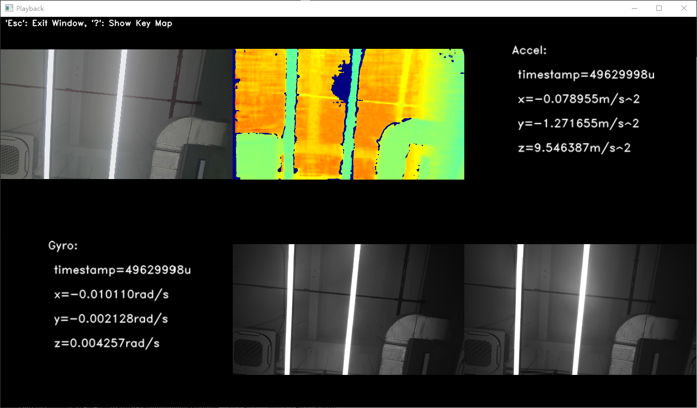

# C++ Sample：2.device.playback

## Overview

This example demonstrates how to use the SDK to read and visualize data from a ROS bag file (.bag) with Orbbec camera streams.

### Knowledge

**Pipeline**: Manages data streams with multi-channel configuration, frame synchronization, and aggregation capabilities.  
**PlaybackDevice**: Reads sensor data from a ROS bag file and feeds it into the processing pipeline.

## code overview

1. Initialize Playback Device and Pipeline

    Create a playback device from a ROS bag file and configure the processing pipeline:

    ```cpp
        // Create a playback device with a Rosbag file
        std::shared_ptr<ob::PlaybackDevice> playback = std::make_shared<ob::PlaybackDevice>(filePath);
        // Create a pipeline with the playback device
        std::shared_ptr<ob::Pipeline> pipe = std::make_shared<ob::Pipeline>(playback);
    ```

2. Enable Recorded Streams
    Activate all sensor streams available in the bag file:

    ```cpp
        std::shared_ptr<ob::Config> config     = std::make_shared<ob::Config>();
        auto                        sensorList = playback->getSensorList();
        for(uint32_t i = 0; i < sensorList->getCount(); i++) {
            auto sensorType = sensorList->getSensorType(i);

            config->enableStream(sensorType);
        }
    ```

3. Start the Pipeline with the Config

    ```cpp
        pipe->start(config);
    ```

4. Automatically restart playback when reaching file end:

    ```cpp
        while(win.run()) {
            auto frameSet = pipe->waitForFrames();
            win.pushFramesToView(frameSet);

            // Handle playback loop when reaching end
            if(playback->getPosition() == playback->getDuration()) {
                // Restart the pipeline if the playback has reached the end of the file
                pipe->stop();
                std::this_thread::sleep_for(std::chrono::milliseconds(100));
                pipe->start(config);
            }
        }
    ```

## Run Sample

Press the 'Esc' key in the window to exit the program.

### Result



